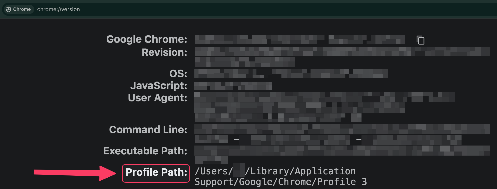

# CSV to Bevy

Add new attendees to Live Events on the Bevy platform through automation!

> [!NOTE]
> Changes to the Bevy platform may break this script. If this happens, please open a new Issue

## Data for environment variables

The `.env` file needs 5 points of data to function properly

Open `chrome://version` on a new Chrome tab and find the appropriate `USER_DATA_DIR` and `PROFILE_DIRECTORY` data at the `Profile Path` section



1. `USER_DATA_DIR`: The path to the Chrome user data directory
   1. For Windows, it defaults to `C:/Users/<USERNAME>/AppData/Local/Google/Chrome/User Data`
   2. For Mac, it defaults to `/Users/<USERNAME>/Library/Application Support/Google/Chrome`
   3. For Linux, it defaults to `/home/<USERNAME>/.config/google-chrome`
2. `PROFILE_DIRECTORY`: The name of the profile directory in the user data directory. This user should be logged into the Google Account that has access to your Bevy dashboard **AND** is already logged into the Bevy platform. In the case of the example picture, it is `Profile 3`
3. `URL`: The URL of the specific Bevy event platform (e.g. `https://gdg.community.dev`)
4. `EVENT_NAME`: The exact name of the event
5. `CSV_FILE`: The path to the CSV file containing the attendee data. Columns should be formatted to `First Name`, `Last Name`, and `Email`

## Configuration

1. Git clone the project

```bash
git clone https://github.com/digaji/csv-to-bevy.git
```

2. CD into the project

```bash
cd csv-to-bevy
```

3. Create virtual environment (Python version for this project == 3.10.11)

```bash
python -m venv venv
```

4. Activate the virtual environment

```bash
# For Windows
venv/Scripts/activate

# For Mac or Linux
. venv/bin/activate
```

5. Install the required libraries

```bash
pip install -r requirements.txt
```

6. Add your attendee CSV data

7. Copy the `.env.template` file to `.env` and fill it with the appropriate data

```bash
cp .env.template .env
# And then fill the keys with the appropriate data
```

8. Stop any running instances of Google Chrome

9. Run the `main.py` file

```bash
python main.py
```

> [!IMPORTANT]
> Stop any running instances of Google Chrome before running this script. Otherwise, the driver will not be able to run
